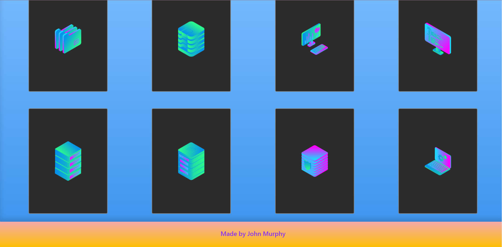
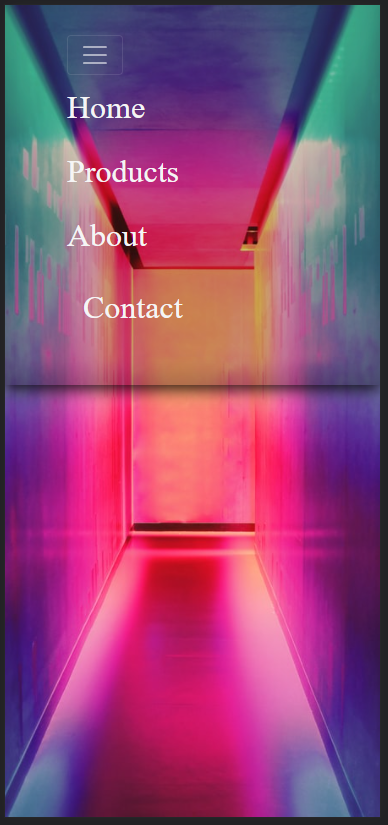
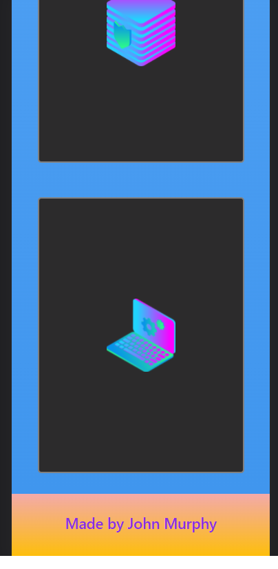

# Mock Landing Page

> A simple landing page built using flexbox, grid and bootstrap.

## Built With

- HTML
- CSS
- Bootstrap

## Live Demo

[Live Demo Link](https://johndmurphy.github.io/css-landing-page/)

## Authors

👤 **Author**

- GitHub: [@JohnDMurphy](https://github.com/JohnDMurphy)

## 🤝 Contributing

Contributions, issues, and feature requests are welcome!

Feel free to check the [issues page](https://github.com/JohnDMurphy/css-landing-page/issues).

## Show your support

Give a ⭐️ if you like this project!

## Acknowledgments

- zerotomastery.io
- Unsplash.com
